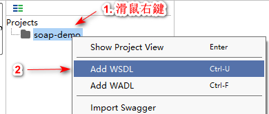
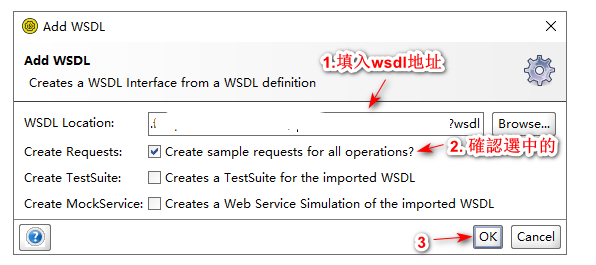
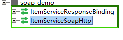

.. _add-wsdl-to-soap-project:

SOAP項目 添加 WSDL
======================

在 已創建好的 SOAP 項目名上右鍵，如下圖:

在彈出的 **Add WSDL** 創建填入資料,如下圖:

點擊 **OK** 之後，需要等待一會，添加完一個 WSDL之後，SOAP項目中就會生成可以調用的操作，如下圖

至此，SOAP項目 添加 WSDL 介紹完畢。