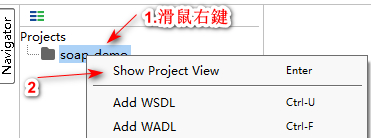
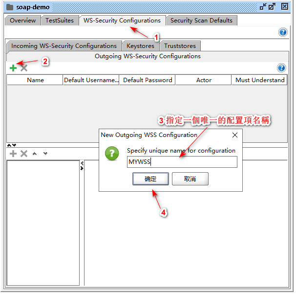
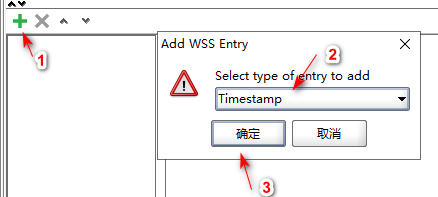
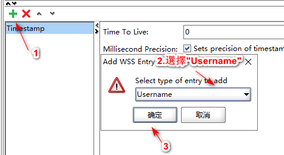
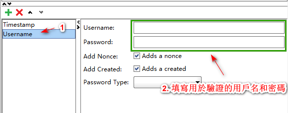

.. _配置SOAP WSS:

配置SOAP WSS
==================

因爲是請求 Oracle Fusion的WSDL, 請求對應的操作是需要在SOAP信封的頭部添加驗證信息。

如果你使用的WSDL地址是不需要驗證的，可跳過本節，直接查看  :ref:`SOAP項目 添加 WSDL`.

在已創建的 SOAP 項目名稱 **右鍵** ，然後選擇 **Show Project View** , 如下圖:

彈出 SOAP 項目的項目預覽窗口，先切換到 **WS-Security Configurations** 選項，按照下圖所示，然後選擇 **Outgoing WS-Security Configurations** 選項

這裏填入的名稱是:**MYWSS**

下一步，向已剛添加好的 **MYWSS** 添加一個 **Timestamp** 實體，如下圖:

下一步，向已剛添加好的 **MYWSS** 添加一個 **Username** 實體，如下圖:

下一步，給**Username** 實體設定用戶名和密碼，用於請求WSDL/SOAP Api驗證使用。

* Password Type: PasswordText

設定 **Username** 實體的用戶名和密碼之後，關閉本次打開 **Project View** 窗口。

至此, 完成了SOAP WSS的配置。