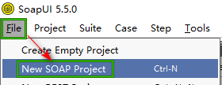
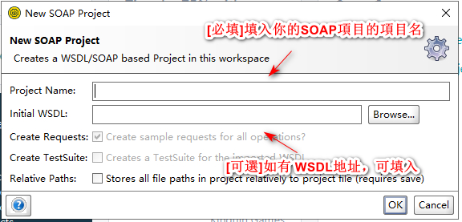
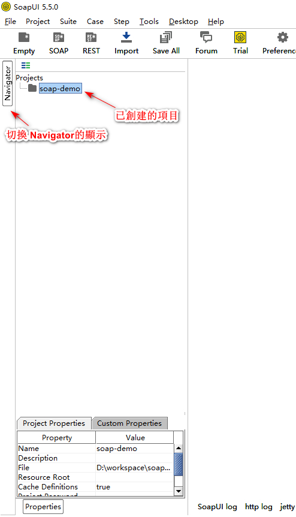

創建 SOAP 項目
==========

介紹在 SoapUI中創建一個新的SOAP項目

通過 菜單 **File** -> **New SOAP Project** 來進行新建SOAP項目

會彈出一個窗口，如下圖

輸入完 項目名稱如: **soap-demo**，點擊 **OK** 按鈕，確認新建項目

創建成功之後，在左邊的窗口可以看到已經創建好的 **soap-demo** 項目了

