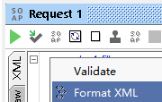

發送請求到對應的操作
======================

這里將會調用 **ItemServiceSoapHttp** 的 **findItem** 操作作爲演示

雙擊 **Request 1** 會彈出一個你可以提交請求的界面,如下圖:

請求的內容是工具通過SOAP信封提供的案例自動生成的，我們的工作是將SOAP信封中填入合理的數據來進行請求。

在這個案例中，我們想 **findItem** 操作。

**添加請求驗證頭信息**:

.. _頭部添加請求驗證頭信息:

爲了能夠驗證成功，首先需要給請求添加請求頭，通過 在請求窗口 右鍵 並選擇 *Outgoing WSS -> Apply MYWSS*

如果 *Outgoing WSS* 沒有可選擇的項，可參考 :ref:`配置SOAP WSS`.

爲了避免出現類似下面的錯誤:

.. code-block::  none

 <env:Fault xmlns:ns0="http://docs.oasis-open.org/wss/2004/01/oasis-200401-wss-wssecurity-secext-1.0.xsd">
         <faultcode>ns0:InvalidSecurityToken</faultcode>
         <faultstring>InvalidSecurityToken : The security token is not valid.</faultstring>
         <faultactor/>
      </env:Fault> 

.. _頭部添加Timestamp信息:

和添加請求頭類似，需要添加 **Timestamp** ,在請求窗口右鍵 並選擇 **Add WS-Timestamp**

如果需要 請求窗口中的XML更方便閱讀，可以選擇 **Format XML**

然後 SOAP信封的內容，使用

.. code-block:: none

   <soapenv:Body>
      <typ:findItem>
         <typ:findCriteria>
            <typ1:fetchStart>0</typ1:fetchStart>
            <typ1:fetchSize>5</typ1:fetchSize>
         </typ:findCriteria>
      </typ:findItem>
   </soapenv:Body>

意思是:查詢5條記錄返回

通過上面的設定，點擊 請求窗口左上角的圖標按鈕，進行發送請求

查看請求結果:

說明: 圖片中的1是指 可以切換返回結果的顯示格式

如上圖中，切換到 **Raw**， 可以看到第1行顯示的是 *HTTP/1.1 200 OK* 表示請求成功了
  
通過查看響應窗口的 **Raw** 顯示，出現以下幾個情況:

* *HTTP/1.1 401 Unauthorized* 是驗證失敗，可參考  頭部添加請求驗證頭信息_ 進行處理
* *HTTP/1.1 500 Internal Server Error* 是請求錯誤，可在右邊的窗口切換到 *XML* 顯示，查看具體的返回的錯誤提示，通常錯誤信息是在 **faultstring** 中可以看到
    
    .. image:: images/fs2019101600020J.jpg

    如果返回的 **faultstring** 是 *InvalidSecurityToken : The security token is not valid.* ，可參考  頭部添加Timestamp信息_ 進行處理

至此,在SoapUI請求wsdl的操作已經介紹完。